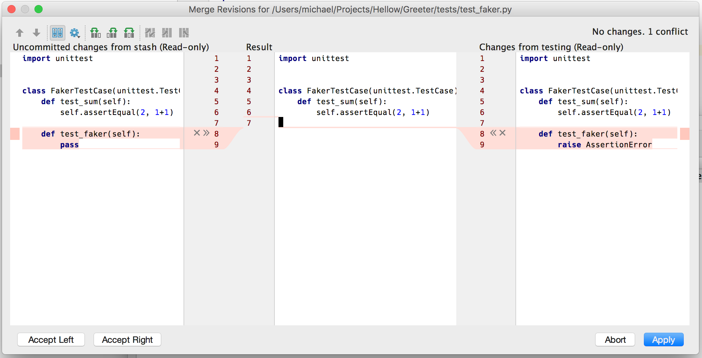
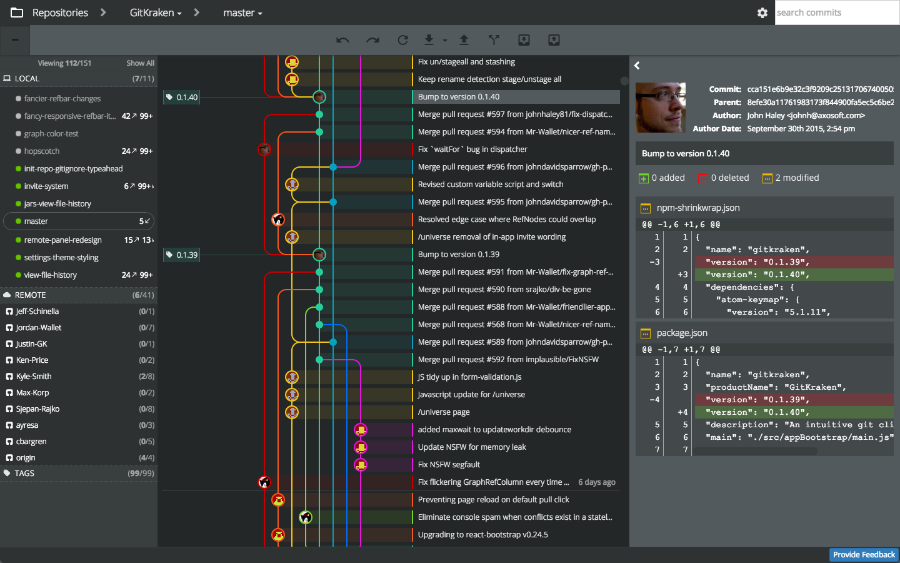

title: Introduction Python et Git
class: animation-fade
layout: true

<!-- This slide will serve as the base layout for all your slides -->
<!--
.bottom-bar[
  {{title}}
]
-->

---

class: impact

# Git 1. Des dépôts de code à partager

---

# Comment gérer du code logiciel ?

## Plusieurs difficultées : 

1. **Suivre** le code avec **précision** :
    - Comme on l'a vu **chaque lettre compte** : une erreur = un bug qui peut être grave
    - **Mémoire** : comment savoir ou l'on en était quand on **revient sur le projet d'il y a deux mois**

1. **Collaboration** : Si on travaille à 15 sur un même programme:
    - Comment **partager** nos modifications ?
    - Comment faire si deux personnes travaillent sur le même fichier = **conflits**

---

# Comment gérer du code logiciel ?

3. **Version** du logiciel :
    - Le développement est un travail **itératif** = contruction petit à petit = pleins de versions !
    - On veut ajouter une nouvelle fonctionnalité à un logiciel, mais continuer à distribuer l'ancienne version et l'améliorer.
    - On veut créer une version de test pour que des utilisateurs avancés trouve des bugs

---

# Solution : un gestionnaire de versions

## 1. Suit **chaque modification** faite à des **fichiers textes** (souvent de code mais peut-être autre chose).

.center[]

---

# Solution : un gestionnaire de versions

## 2. Permet de **stocker plusieurs version** des **même fichiers** et passer d'un version à l'autre.

.center[]

---


# Solution : un gestionnaire de versions

## 3. Permet suivre **qui** a fait quelle modification, **partager les modifications** avec les autres, **régler les conflits**

.center[]

---

class: impact

# Git !

---

# Git !

**git** est un petit programme en ligne de commande. Qui fait tout ce dont on vient de parler:
- Suit les fichiers
- Gère les modifications successives et leurs auteurs
- Fait cohabiter plusieurs versions
- Aide à résoudre les conflits de code

---

#  Écosystème git :
## !! à ne pas confondre !!

- **git** : le gestionnaire de version = le coeur de l'écosystème = en ligne de commande
- **les interfaces/GUI de git** : VSCode, tig, meld, gitkraken, etc
    - Pour faciliter l'utilisation de git et visualiser plus facilement
    - communique avec **git** sans le remplacer 
- **les forges logicielles** basée sur git comme **github** ou **framagit**:
    - des plateformes web pour accéder au dépot / mettre son code sur les internets.
    - faciliter la collaboration sur un projet
    - tester et déployer le code automatiquement comme dans la démarche DevOps (plus avancé)

On va utiliser **les trois** car c'est nécessaires pour bien comprendre comment on travaille avec git sur un projet.

---

# On va utiliser

- **git** en ligne de commande souvent = il faut absolument connaître les fonctions de base pour travailler sur un projet aujourd'hui
- **VSCode** : un éditeur de texte qui a des fonctions pratiques pour visualiser les modifications git et l'historique d'un projet, afficher les conflits.
- **framagit** : une forge logicielle qui défend le logiciel libre (basée sur gitlab). On va l'utiliser pour collaborer sur le TP de jeux vidéos.

---

class: impact

# Git, fonctions de base

---

# Récuperer un dépôt sur une forge 

## $ `git clone <url>`

### Exemple

```
$ git clone https://github.com/miguelgrinberg/flasky

Clonage dans 'flasky'...
remote: Enumerating objects: 897, done.
remote: Total 897 (delta 0), reused 0 (delta 0), pack-reused 897
Réception d'objets: 100% (897/897), 195.05 KiB | 846.00 KiB/s, fait.
Résolution des deltas: 100% (497/497), fait.

$ cd flasky

flasky (git)-[master] $ 
```

---

# Connaître l'état d'un dépôt

## (git)-[master] $` git status`

```bash
Sur la branche master
Votre branche est en avance sur 'origin/master' de 1 commit.
  (utilisez "git push" pour publier vos commits locaux)

Modifications qui ne seront pas validées :
  (utilisez "git add <fichier>..." pour mettre à jour ce qui sera validé)
  (utilisez "git checkout -- <fichier>..." pour annuler les modifications dans la copie de travail)

	modifié :         plan.md

Fichiers non suivis:
  (utilisez "git add <fichier>..." pour inclure dans ce qui sera validé)

	git_1_intro_clone.md
	img/git_diff.png
	img/gitkraken.png
	img/merge_3_versions.png

aucune modification n'a été ajoutée à la validation (utilisez "git add" ou "git commit -a")
```

---

# Connaître l'historique du dépôt
   
## (git)-[master] $` git log`

```bash
commit 0d83d44e0f9e95e11a5ff5015a6a2b53eb06d44a (HEAD -> master)
Author: Elie Gavoty <eliegavoty@free.fr>
Date:   Fri Nov 23 15:20:12 2018 +0100

    update toc with git

commit 4be0d90677859ecbf143bf5770f2266f72afaf65 (origin/master, origin/HEAD)
Author: Elie Gavoty <eliegavoty@free.fr>
Date:   Thu Nov 22 18:51:43 2018 +0100

    refacto cut & more

commit 15b80bdd9ebb3966a17d5c9d323b6b8e6cfaa863
Author: Elie Gavoty <eliegavoty@free.fr>
Date:   Thu Nov 22 16:59:22 2018 +0100

    slides custo 1
```

---

# Afficher les modifications récentes du dépôt
   
## (git)-[master] $` git diff`


---

