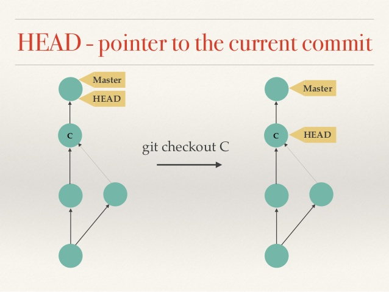

title: Introduction Python et Git
class: animation-fade
layout: true

<!-- This slide will serve as the base layout for all your slides -->
<!--
.bottom-bar[
  {{title}}
]
-->

---

class: impact

# Git - première partie

## Des dépôts de code à partager

---

# Comment gérer du code logiciel ?

## Plusieurs difficultées : 

1. **Suivre** le code avec **précision** :
    - Comme on l'a vu **chaque lettre compte** : une erreur = un bug qui peut être grave
    - **Mémoire** : comment savoir ou l'on en était quand on **revient sur le projet d'il y a deux mois**

1. **Collaboration** : Si on travaille à 15 sur un même programme:
    - Comment **partager** nos modifications ?
    - Comment faire si deux personnes travaillent sur le même fichier = **conflits**

---

# Comment gérer du code logiciel ?

3. **Version** du logiciel :
    - Le développement est un travail **itératif** = contruction petit à petit = pleins de versions !
    - On veut ajouter une nouvelle fonctionnalité à un logiciel, mais continuer à distribuer l'ancienne version et l'améliorer.
    - On veut créer une version de test pour que des utilisateurs avancés trouve des bugs

---

# Solution : un gestionnaire de versions

## 1. Suit **chaque modification** faite à des **fichiers textes** (souvent de code mais peut-être autre chose).

.center[]

---

# Solution : un gestionnaire de versions

## 2. Permet de **stocker plusieurs version** des **même fichiers** et passer d'un version à l'autre.

.center[]

---

# Solution : un gestionnaire de versions

## 3. Permet suivre **qui** a fait quelle modification, **partager les modifications** avec les autres, **régler les conflits**

.center[]

---

class: impact

# Git !

---

# Git !

**git** est un petit programme en ligne de commande. Qui fait tout ce dont on vient de parler:
- Suit les fichiers
- Gère les modifications successives et leurs auteurs
- Fait cohabiter plusieurs versions
- Aide à résoudre les conflits de code

---

#  Écosystème git :
## !! à ne pas confondre !!

- **git** : le gestionnaire de version = le coeur de l'écosystème = en ligne de commande
- **les interfaces/GUI de git** : VSCode, tig, meld, gitkraken, etc
    - Pour faciliter l'utilisation de git et visualiser plus facilement
    - communique avec **git** sans le remplacer 
- **les forges logicielles** basée sur git comme **github** ou **framagit**:
    - des plateformes web pour accéder au dépot / mettre son code sur les internets.
    - faciliter la collaboration sur un projet
    - tester et déployer le code automatiquement comme dans la démarche DevOps (plus avancé)

On va utiliser **les trois** car c'est nécessaires pour bien comprendre comment on travaille avec git sur un projet.

---

# On va utiliser

- **git** en ligne de commande souvent = il faut absolument connaître les fonctions de base pour travailler sur un projet aujourd'hui
- **VSCode** : un éditeur de texte qui a des fonctions pratiques pour visualiser les modifications git et l'historique d'un projet, afficher les conflits.
- **framagit** : une forge logicielle qui défend le logiciel libre (basée sur gitlab). On va l'utiliser pour collaborer sur le TP de jeux vidéos.

---

class: impact

# Git, fonctionnement de base

---

# .center[Warning: git est à la fois simple et compliqué.]

## Mémoriser les commandes prend du temps : 
### Utilisez votre memento !

- On va utilisez les commandes de base durant les 3 prochains jours pour se familiariser avec le **fonctionnement normal**.

- En entreprise on utilise tout le temps git avec une routine simple. On y reviendra.

- Même les ingénieurs avec de l'expérience ne connaissent pas forcément les fonctions avancées.

---

# 1. Créer un nouveau dépôt git, valider une premiere version du code

vous êtes dans un dossier avec du code:
- `git init` créé un dépôt dans ce dossier
- `git add` permet de suivre certains fichier
- `git commit` permet valider vos modifications pour créer ce qu'on appelle un **commit** c'est-à-dire une étape validée du code.
- `git status` et `git log` permettent de suivre l'état du dépôt et la liste des commits.

---

# Le commit

## **to commit** signifier **s'engager**

- **Idéalement**, lorsque vous faite un commit, le code devrait être dans un état à peu près **cohérent**.

## Toujours mettre un **message** de commit

- Les commits sont des étapes du développement du logiciel. Lire la liste de ces étapes devrait permettre à un.e developpeur de comprendre l'évolution du code.

---

class: impact

# Créer un nouveau dépot : Démonstration !

---

#Git cycle des fichiers

.col-6[]
.col-6[
    
     
     `git rm fichier` pour désindexer.
      Tracked = suivi
      Staged = inclus (dans le prochain commit)
    ]

---

class: impact

# Premier exercice

---

class: impact

# 2. Explorer un dépôt existant

---

# 2. Explorer un dépôt existant

Il s'agit de **télécharger** le dépôt d'un **logiciel** depuis internet et d'explorer son **historique**:
- `git clone <url dépot>` puis `cd <dépôt>` pour aller dans le dossier du dépôt
- `git log` pour voir la liste des commits
- `git checkout <commit num>` pour vous **déplacer** au niveau d'un commit : le code dans le dépôt **change**.
- `git diff <commit_1> <commit_2>` pour voir ce qui a changé entre deux commits.
- Plus pratique : `apt install tig` et `tig` pour explorer chaque commit ou alors utilisez **VSCode** et **GitLens**

---

## L'historique d'un dépôt

---

## Master et les branches d'un dépôt

.col-5[.col-10[]]
--

- Un dépôt git permet d'avoir **plusieurs historiques** en parallèles qu'on appelle des **branches**. Un dépôt git ressemble à un arbre.
--

- La **branche principale** s'appelle **master** dans git (par convention)
--

- Ça commence à devenir compliqué ! On va seulement travailler avec **deux branches** dans les prochains jours ;) :
--

- **master** + **une branche** pour votre travail en cours.

---

## Remonter le temps, déplacer HEAD

- Si git **mémorise les commit successifs** du dépôt c'est en particulier pour:
    - Permettre de "*remonter le temps*", c'est-à-dire **remettre le code** du dépôt **dans un état antérieur**.
    - `git checkout <num_commit>`. L'historique se met également à jour.
    - `git diff` permet à tout moment d'afficher les différences entre deux points du dépôt.

--

- Dans git, **HEAD** désigne un curseur qui indique dans quel état est le dépôt actuellement.
    - par défaut **HEAD** pointe sur le dernier commit de la branche (master s'il n'y en a qu'une).
    - remonter le temps cela signifie déplacer **HEAD**.
    - `git reflog` affiche l'historique des déplacement de **HEAD**.

---

## Déplacer HEAD dans l'historique

.col-6[]

---

## GitLens pour explorer l'historique d'un dépôt.

Plusieurs éditeurs de code proposent des interfaces graphique pour:
- naviguer dans les modifications d'un dépôt.
- comparer plusieurs état du dépôt.

C'est le cas de VSCode, en particulier avec l'extension **GitLens**.

D'autres interfaces pratiques et indépendantes de l'éditeur: tig, meld, ...

???

Installer GitLens sur les postes...

---

class: impact

# Explorer un dépôt
# Démonstration

???

Utiliser par exemple le dépôt des exercices. pour revenir au début sur du code que les étudiants connaissent.

---

class: impact

# Deuxième

---

# 3. Le merge

TODO

